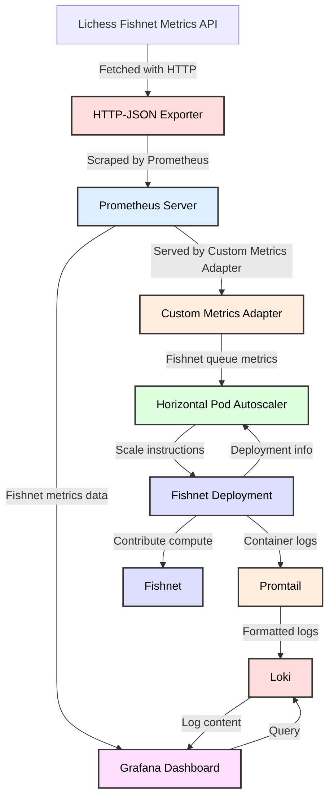

# Fishwatch

## Purpose

This project has two goals:

1. Provide out-of-the-box visibility into Fishnet performance.
2. Offer [autoscaling](https://github.com/lichess-org/fishnet/tree/a798db810c711ee672d2d8f7baa6cf213a9d38f1?tab=readme-ov-file#can-i-autoscale-fishnet-in-the-cloud) for efficient resource utilization.

For the first goal, Fishwatch uses a simple Promtail, Loki, Grafana monitoring setup to track analysis logs and display results on a dashboard.


For the second, Fishwatch uses the Kubernetes Horizontal Pod Autoscaler combined with Prometheus to scale Fishnet instances based on the Lichess Fishnet game queue size. For more details, see [Architecture](#architecture)


### What is Fishnet?

Fishnet is a distributed chess engine network that analyzes games played on lichess.org. Anyone with a Lichess account can volunteer their compute resources to help the network.

To learn more about Fishnet, check out their repository: [Fishnet GitHub](https://github.com/lichess-org/fishnet).

This repository is not associated with Lichess. Just an independent tool some may find useful.

## Setup Guide


### Prerequisites

- **Lichess Account**: [Sign up here](https://lichess.org/signup)
- **API Key**: [Get your API key here](https://lichess.org/get-fishnet)
- **Git**: [Install Git](https://git-scm.com/book/en/v2/Getting-Started-Installing-Git)
- **Kubectl**: [Install Kubectl](https://kubernetes.io/docs/tasks/tools/)
- **Kubernetes Cluster**: EKS, AKS, GKE, Minikube, etc. You may have to adjust the Storage Classes depending on the cluster host.
- **Helm**: [Install Helm](https://helm.sh/docs/intro/install/)
- **Helm Diff** (required by Helmfile): [Install Helm Diff](https://github.com/databus23/helm-diff)
- **Helmfile**: [Install Helmfile](https://github.com/helmfile/helmfile)


### Steps

1. **Clone the Repository**:
   ```bash
   git clone https://github.com/mattdonnelly10/fishwatch.git
   cd fishwatch
2. **Replace the placeholder with your Lichess API key**:
   ```bash
   # base64 encode your API key

   echo -n "<your key here>" | base64
 
   vim values/fishnet-values.yaml

   # Update the value below with your encoded key

   secret:
     fishnetPrivateKey: <your base64 encoded key here> 


   # You may want to edit the minimum and maximum containers your Fishnet cluster can scale to. Keep in mind, each replica will use as many cores as you have set in your config (default is 1).

   hpa:
      minReplicas: 1
      maxReplicas: 4

   # You can change the number of cores each container will use, but I recommend leaving it with the default for flexible scaling.

   configMap:
      cores: "1"

   # If you are an advanced user, you can also modify the settings of the other releases (Grafana, Loki, etc) in this values directory.

3. **Deploy with Helmfile**:
   ```bash
   # First check the helmfile diff to make sure everything looks good
   helmfile diff

   # Then deploy when you are ready, it will take a few minutes
   helmfile apply
3. **Access Fishwatch Dashboard**:
   ```bash
   # Get Grafana pod name
   GRAFANA_POD=$(kubectl get pods -n fishwatch | grep '^grafana-' | awk '{print $1}')

   # In another terminal, get your Grafana password
   GRAFANA_SECRET=$(kubectl get secret --namespace fishwatch grafana -o jsonpath="{.data.admin-password}" | base64 --decode ; echo)

   echo "Username: Admin\nPassword: $GRAFANA_SECRET"

   # Establish port-forwarding to your Grafana instance
   kubectl port-forward pod/$GRAFANA_POD 3000:3000 -n fishwatch

   # Open your Fishwatch dashboard and login with username Admin and password retrieved in the previous step: 
   http://localhost:3000/d/bdu4gq2bbaxogb/fishwatch?orgId=1

## Persistence 

If you want to change the storage classes to fit your needs, you can do so here: 

- values/loki-values.yaml
- values/prometheus-values.yaml
- values/grafana-values.yaml

## Architecture

Here is a design diagram of the Fishwatch appliation.
